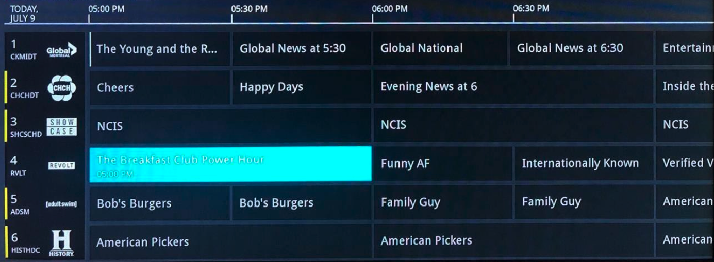

# Test task - Demo TVGuide

## Brief from task:

The mockup API returns 30 channels and programs for two days. (actually - little bit more then 24 hours)
The test application should display TVGuide from API as shown in mockup design below. (Do the design as simple as possible; do not add images for channels as you do not have them)

User should be able to scroll up/down and left/right through all channels and all available programs.

**_Most important in this task is creating extendable architecture, which will allow lazy-loading and caching of program items in the future._**

Also please, use object-oriented approach wherever it is possible to make the application easy maintainable and more robust.

_What we expect eventually as the result of this task, 2 pages:_
1. First page with development (architecture) plan how this part should be implemented. Please, use SWIFT, Viper, Diffable Datasource(optional) and Swagger to build contracts from API.
2. Second page with sample code – just a page with your code of some part of this task. No matter what exactly would be coded. In fact, we just want to see how you code in terms of using object-oriented approach.

Preferable to have this for tvOS.
Usually, we expect developers to complete test assignments in 1 week.

# Here lies some messy initial commit, but it's ok for the start

## pre-requests for project

+ Cocoapods
+ Brew

## pre-requests for codegen

OpenApi codegen requires: `brew install openapi-generator`

(Optional) Formatting: `brew install swiftformat` 

Before executing codegen: `export SWIFT_POST_PROCESS_FILE="/usr/local/bin/swiftformat"`

Executing codegen: `openapi-generator generate --enable-post-process-file -i demo-c.cdn.vmedia.openapi.yaml -g swift5 --additional-properties=projectName=DemoTvGuideSwaggerApi -o DemoTvGuideSwaggerApi`

??? add this codegen call somewhere ??? doubt where to...

Run `pod install`
